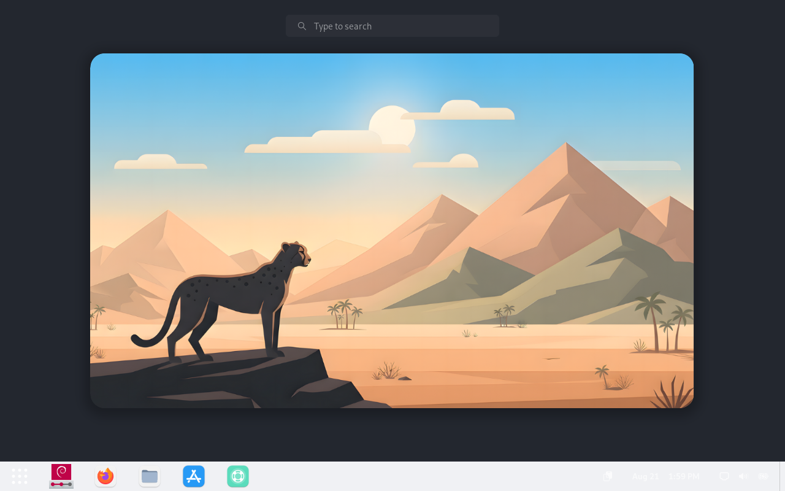
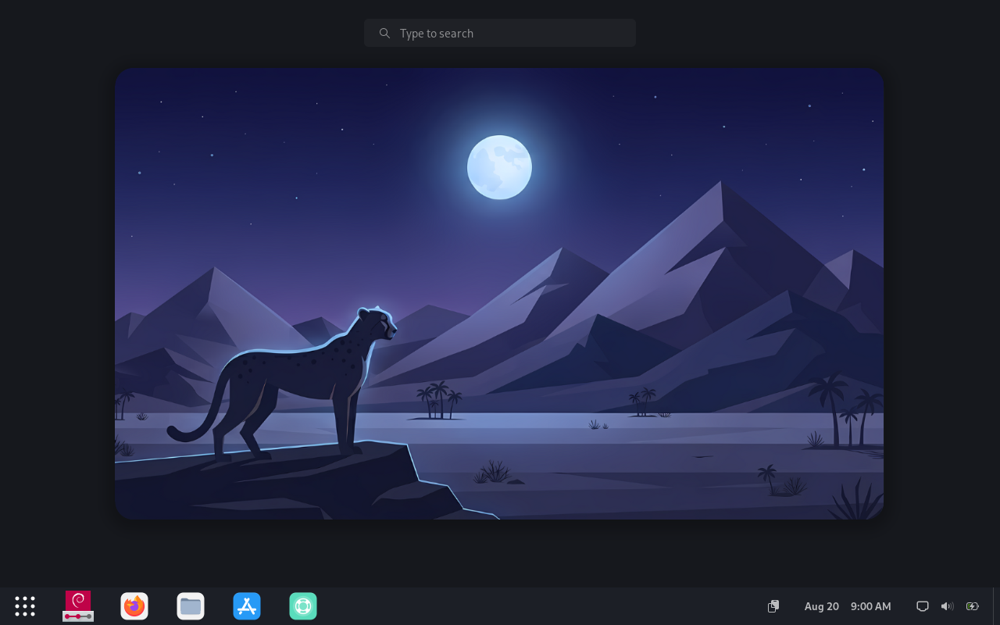
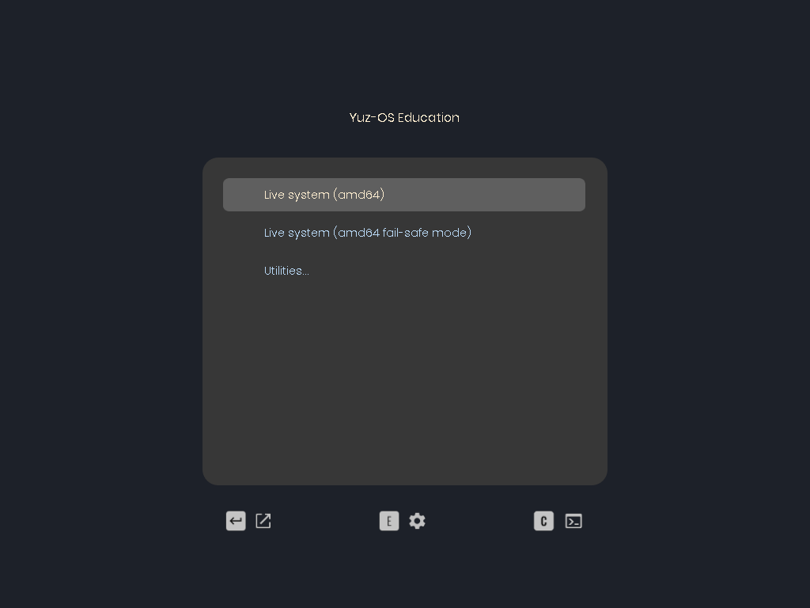
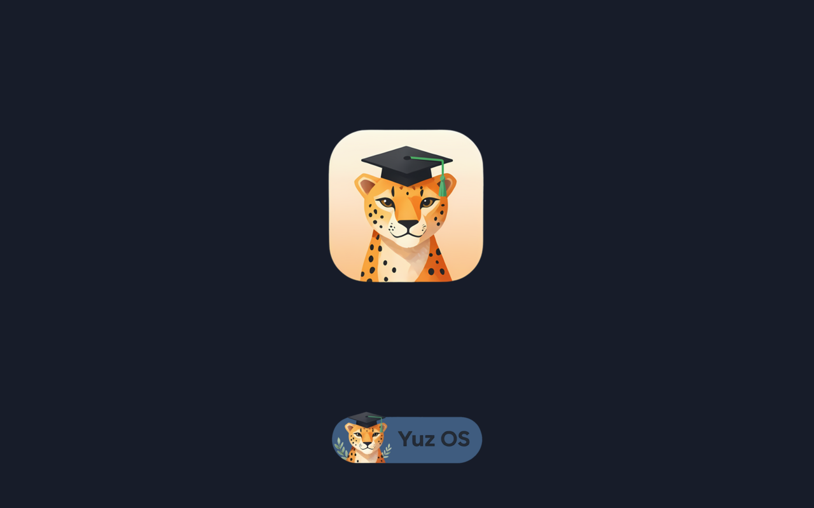

<p align="center">
  
</p>

<p align="center"> 🐆 Yuz-OS Edu

<p align="center">🎓 Free • Fast • Open Source Educational Platform

<p align="center"> Building modern digital classrooms with the power of Debian and Free Software.

---

## 📚 About Yuz-OS Edu

> «Persian Documentation: [README-fa.md](/README-fa.md)»

Yuz-OS Edu is an educational operating system and deployment framework designed specifically for schools, laboratories, teachers, and students.

Instead of creating yet another Linux distribution, the project focuses on solving one real-world problem:

«How can schools build modern computer classrooms without replacing all of their hardware?»

Many educational environments still rely on older computers because upgrading hardware is often expensive. At the same time, installing, maintaining, and configuring educational software on dozens of systems is time-consuming.

Yuz-OS Edu addresses this challenge by providing a complete educational platform built on Debian 13, combining a carefully selected collection of educational software, a customized desktop experience, automated deployment tools, and a modular build framework.

The project enables schools to transform existing computers into modern educational workstations while minimizing deployment costs and maintenance complexity.

---

## 🎯 Project Mission

Yuz-OS Edu was created with one primary objective:

«Making high-quality digital education accessible to every school using Free and Open Source Software.»

**The project aims to improve learning environments by providing an integrated platform that:**

- reduces software deployment costs;
- extends the lifetime of older hardware;
- improves classroom usability;
- provides students with interactive learning tools;
- helps teachers build engaging digital lessons;
- promotes the adoption of Free and Open Source Software (FOSS).

Rather than simply installing applications, Yuz-OS Edu creates a complete educational environment where software, interface design, system configuration, and deployment work together as one cohesive platform.

---

## ❓ Why Yuz-OS Edu?

**Schools commonly face challenges such as:**

- 💰 Limited budgets
- 🖥️ Aging computer hardware
- ⚙️ Difficult software deployment
- 🌐 Limited Internet connectivity
- 📦 Fragmented educational software
- 🔧 High maintenance costs

**Yuz-OS Edu solves these challenges by providing:**

- ✅ Ready-to-use educational software
- ✅ Optimized performance on older systems
- ✅ Unified desktop experience
- ✅ Automated installation and deployment
- ✅ Offline-ready educational environment
- ✅ Centralized software management
- ✅ Modern GNOME desktop optimized for education

---

## 🐆 Why "Yuz"?

The project is named after the Asiatic Cheetah (Yuz), one of Iran's most iconic and endangered animals.

**The cheetah represents the core philosophy behind the project:**

- ⚡ Speed
- 🧠 Intelligence
- 🎯 Efficiency
- 🔧 Adaptability

These values define Yuz-OS Edu itself:

**«Light. Fast. Smart.»**

---

## ✨ What's New in Yuz-OS Edu v1.2.0

Yuz-OS Edu has evolved from a customized Debian Live image into a modular and identity-driven educational operating system project.

The project now provides a structured build framework for creating customized educational distributions with a consistent system architecture, visual identity, and deployment workflow.

Version 1.2.0 introduces the finalized Yuz OS identity, improved build reliability, refined system branding, and a more consistent desktop experience across the live environment and installed system.

**This release includes:**

- Finalized Yuz OS project metadata
- A unified branding architecture
- Improved GRUB and Plymouth integration
- Dedicated branding packages for system-wide customization
- More reliable APT mirror handling during the build process
- Improved build and deployment workflow
- Integrated third-party applications such as VS CodeOME desktop customization
- Final ISO, z with ZRAM and swap configuration
- Refined GNOME desktop customization
- Final ISO, zsync, and checksum release artifacts

Yuz-OS Edu v1.2.0 establishes a stable foundation for the project’s unified identity and future development.

**One Project. One Identity.**

---

## 🏗 Project Architecture

Unlike traditional Linux remasters that simply modify an existing ISO, Yuz-OS Edu introduces its own modular build system built on top of Debian Live Build.

The architecture separates the project into independent layers, making every component easier to maintain, extend and customize.

```
Yuz-OS Edu
│
├── Documentation
├── Branding Assets
├── Release Packages
├── Testing
└── Live Build Framework
        │
        ├── Yuz Builder
        ├── Modular Framework
        ├── Build Modules
        ├── Configuration
        ├── Debian Live Build
        └── ISO Output
```

This design allows every subsystem to evolve independently without affecting the rest of the project.

---

## ⚙ Yuz Builder Framework

One of the biggest improvements introduced in version 1.1.x is the creation of the Yuz Builder Framework.

Rather than asking users to manually configure Debian Live Build, Yuz Builder automates the complete process.

**The framework performs tasks such as:**

- validating the build environment;
- checking hardware resources;
- installing missing dependencies;
- preparing the build workspace;
- loading framework components;
- executing user-selected modules;
- launching Debian Live Build;
- generating the final ISO image.

Instead of editing dozens of configuration files manually, users interact with a guided setup wizard that prepares everything automatically.

---

## 🧩 Modular Design

Every major feature inside the builder is implemented as an independent module.

Current module categories include:

Build Modules

Responsible for configuring and generating the Debian Live Build environment.

**Examples:**

- Build Configuration
- Live Build Automation

---

## Flatpak Modules

Responsible for creating and managing the offline Flatpak repository shipped with Yuz-OS Edu.

**Capabilities include:**

- downloading applications;
- building the repository;
- preparing applications for offline installation;
- integrating Flatpak into the final operating system.

---

## Runtime Modules

Executed during installation or first boot to configure the operating system automatically.

**Examples include:**

- desktop customization;
- theme installation;
- icon installation;
- wallpaper deployment;
- Flatpak initialization.

---

## Framework Modules

Shared utilities used throughout the entire build process.

**Examples:**

- environment management;
- logging;
- filesystem utilities;
- runtime helpers;
- package management;
- user interface helpers.

This modular design makes it possible to extend the builder without rewriting existing code.

---

## 🚀 Build Pipeline

The build process follows a structured pipeline.

```
setup.sh
      │
      ▼
System Validation
      │
      ▼
Dependency Installation
      │
      ▼
Framework Initialization
      │
      ▼
Module Selection Wizard
      │
      ▼
Module Execution
      │
      ▼
Debian Live Build
      │
      ▼
Build-time Modules
      │
      ▼
Hybrid ISO Generation
```
**This pipeline significantly reduces the amount of manual work required to generate new releases.**

---

## 📦 Offline Flatpak Repository

Version 1.1.x introduces one of the most important features of the project:

Built-in Offline Flatpak Repository

Instead of requiring Internet access after installation, Yuz-OS Edu ships with its own Flatpak repository.

Applications are prepared during the build process and become immediately available after installation.

**Benefits include:**

- reduced deployment time;
- offline software installation;
- simplified software management;
- consistent application versions across classrooms.

This is particularly useful for schools where Internet connectivity is unreliable or limited.

---

## 🎨 Custom Desktop Experience

Yuz-OS Edu is not merely a collection of software.

The desktop environment has been carefully designed to provide a consistent, focused, and accessible experience for educational use.

The system combines GNOME customization, a unified visual language, and carefully selected desktop components to ensure that the live environment and installed system share the same identity.

**The desktop experience includes:**

- Graphite GTK Theme
- Colloid Icon Theme
- Custom Yuz OS wallpapers
- Persian font collection
- Customized GNOME Desktop
- Preconfigured GNOME Extensions
- Refined GDM appearance
- Integrated desktop branding
- A focused layout for educational workflows
- Selected applications for productivity and learning

Visual assets and desktop configuration are integrated into the deployment process, helping ensure that every generated system provides a consistent Yuz OS experience.

---

## 🏫 Educational Software Collection

Yuz-OS Edu ships with a carefully selected collection of educational applications covering multiple subjects.

**These include software related to:**

- Physics
- Chemistry
- Mathematics
- Electronics
- Astronomy
- Programming
- Classroom Productivity
- Research
- Digital Note Taking
- Interactive Learning
- Dictionaries
- Typing Practice
- Educational Simulations

Applications are delivered using both Debian packages and Flatpak, depending on the software requirements and update strategy.

Rather than maximizing the number of applications, the project focuses on selecting tools that are practical, reliable, and appropriate for educational environments.

---

## 📁 Repository Structure

**The repository is organized into several independent components to simplify maintenance and future development.**

```
Yuz-OS_Edu
│
├── archive/          Previous releases and archived resources
├── branding/         Project branding assets
├── docs/             Technical documentation
├── live-build/       Yuz Builder Framework
├── release/          Release packages
├── test/             Testing resources 
├── LICENSE
├── README.md
└── README-fa.md
```

The `live-build/` directory contains the complete build framework responsible for generating Yuz-OS Edu.

---

## 🛠 Build Requirements

The build environment is intentionally standardized to guarantee reproducible releases.

**Supported Build Platform**

- Debian GNU/Linux 13 (Trixie)
- 64-bit (amd64)

**Minimum Hardware**

- 6 GB RAM
- 20–30 GB free storage
- Stable Internet connection

**Recommended**

- 8 GB RAM
- SSD storage
- Multi-core processor

>[!IMPORTANT]
>Build time depends on hardware performance and network speed and usually ranges from 1 to 2 hours.

---

🚀 Building Yuz-OS Edu

Building the project is intentionally simple.

**Clone the repository:**

```bash
git clone https://github.com/emad1234-msoudi/Yuz-OS_edu.git
```

**Enter the build directory:**

```bash
cd Yuz-OS_edu/live-build
```

**Make the setup script executable:**

```bash
chmod +x setup.sh
```

**Run the setup wizard:**

```bash
./setup.sh
```

**The builder will automatically:**

- validate your system;
- install missing packages;
- initialize the framework;
- let you choose optional modules;
- prepare Debian Live Build;
- execute build-time modules;
- generate the final Hybrid ISO.

---

## 🎨 Branding

Yuz-OS Edu includes a unified visual identity designed specifically for an educational operating system.

The branding system is not limited to the desktop. It extends across the system lifecycle—from the initial boot screen to the login experience and the final desktop session.

**The branding system includes:**

- Custom Yuz OS project logo
- Finalized project metadata
- Dedicated branding packages
- Graphite GTK Theme
- Colloid Icon Theme
- Custom wallpapers
- Persian font collection
- GNOME desktop customization
- GRUB theme customization
- Plymouth boot theme
- Boot-time visual branding
- GDM and login screen customization
- Startup sound integration

The core branding components are organized into dedicated packages, making the identity layer easier to maintain, reuse, and extend across future Yuz OS builds.

This unified approach ensures that Yuz OS Edu presents one consistent identity throughout the entire user journey:

**Boot. Login. Desktop.**

**One Project. One Identity.**

---

## 📸 Screenshots

**The following screenshots demonstrate the default desktop environment shipped with Yuz-OS Edu.**

<details>
<summary>🌄 Desktop Light</summary>
  
</details>
<details>
<summary>🎑 Desktop Dark</summary>
  
</details>
<details>
<summary>| Live-grub theme</summary>
  
</details>
<details>
<summary>| Plymouth theme</summary>
  
</details>

>[!TIP]
>«Screenshots are located inside the [**docs/images**](./docs/images/) directory.»

---

## 📖 Documentation

Additional documentation is available inside the [**docs/**](./docs/) directory.

**Topics include:**

- Builder Framework
- Modular Architecture
- Build Process
- Flatpak Repository
- Branding
- Development Guide
- Contribution Guide

Future versions will continue expanding the documentation.

---

## 🗺 Roadmap

Yuz-OS Edu continues to evolve as a modular, identity-driven, and offline-first educational operating system.

### ✅ Completed in v1.2.0

- [x] **Core Branding System:** Core Identity, GRUB/Plymouth, Metadata, and Branding Packages.
- [x] **Builder Architecture:** Modular builder system for identity and APT management.
- [x] **Educational Software Suite:** Integrated math tools, interactive content, and learning apps.
- [x] **Offline Management:** Local repository support, Flatpak Bazaar, and offline APT capabilities.
- [x] **Hardware Compatibility:** Extensive driver support and kernel optimization.
- [x] **System Security:** Firewall, Fail2ban, ClamAV, Lynis, and ClamUI integration.
- [x] **Build Reproducibility:** Consistent and reliable build framework.

### 🚧 In Progress / Planned

- [ ] **Complete Project Documentation**
    - [ ] Write detailed Build Framework guide.
    - [ ] Create comprehensive Installer troubleshooting guide.
    - [ ] Document the Branding API and module structure.
    - [ ] Maintain the user-facing README.
- [ ] **Extend Branding:** Further branding for Calamares, Fastfetch, and system-specific utilities.
- [ ] **Improve Installer:** Refine Calamares branding and persistent installation testing.
- [ ] **Educational Content:** Develop/Curate offline-first interactive learning tools and web-like resources.
- [ ] **Release Automation:** Implement CI/CD for automated release generation and validation.

---

## 🤝 Contributing

Contributions are always welcome.

**You can contribute by:**

- reporting bugs;
- suggesting improvements;
- improving documentation;
- translating content;
- testing new releases;
- submitting pull requests.

Every contribution helps improve educational technology for everyone.

---

## 👨‍💻 Author

Emad Masoudi

Student Developer

Creator of Yuz-OS Edu

This project was developed to demonstrate how Free and Open Source Software can improve educational environments while reducing deployment costs and extending the useful life of existing hardware.

---

## ❤️ Acknowledgements

**Special thanks to the communities behind:**

- [Debian Project](https://www.debian.org/)
- [GNOME Project](https://www.gnome.org/)
- [Debian Live Build](https://live-team.pages.debian.net/live-manual/)
- [Flatpak](https://flatpak.org/)
- [Calamares](https://calamares.io/)
- [GNU Project](https://www.gnu.org/)
- [Linux Kernel](https://www.kernel.org/)
- Free and Open Source Software contributors

Without their incredible work, projects like Yuz-OS Edu would not be possible.

---

## 📄 License

This project is distributed under the MIT License.

**See the [LICENSE](/LICENSE) file for details.**

---

<p align="center">

<p align="center">Free • Fast • Open Source Educational Platform

<p align="center">Helping schools build modern digital classrooms using Debian and Free Software.

<p align="center">Education should be accessible, modern, and open to everyone.